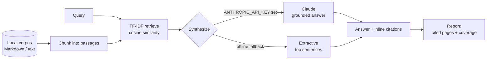

# answer-engine-simulator

> Preview how an AI answer engine would answer a query from your own site content — and whether it would cite your pages.


## Overview

Search is shifting from a list of blue links to a single synthesized answer, and
**Generative Engine Optimization (GEO)** is the practice of making sure your
content is the content those answers are built from. The question GEO asks is no
longer just "do I rank?" but "when an AI answers this question, does it draw on
*my* pages, and does it *cite* them?"

`answer-engine-simulator` is a small tool for exploring that question offline. Point
it at a folder of your Markdown/text pages, ask a question, and it shows you which
passages an answer engine would likely retrieve, a synthesized answer with inline
citations, and which of your pages ended up cited.

> **This is a simulation, not a real answer engine.** It approximates
> answer-engine behavior with classic TF-IDF retrieval plus optional Claude
> synthesis. It does not reproduce any specific engine's retriever, ranking, or
> answer format, and its "visibility" signals are heuristics for exploration — not
> a prediction of how you will actually be cited in production. It's a
> portfolio/demo project.

## Architecture



## Features

- **Local corpus ingestion** — treats every Markdown/text file in a directory as
  one "page", split into passage-sized chunks so citations point at a paragraph,
  not a whole document.
- **Transparent TF-IDF retrieval** — scikit-learn cosine similarity ranks the
  passages an engine would likely draw on; zero-similarity matches are dropped, so
  a query your corpus doesn't cover returns nothing (itself a visibility signal).
- **Two synthesis paths, one output contract** — a Claude-written answer when an
  API key is present, and a fully offline extractive answer otherwise. Callers
  never branch on which path ran.
- **Graceful fallback** — any Claude/SDK error falls back to the extractive path,
  so the tool always produces an answer.
- **Citation reporting** — shows which of your pages were cited and a coverage note
  estimating AI-answer visibility.

## Tech stack

- **Python 3.10+**
- **[Click](https://click.palletsprojects.com/)** — CLI
- **[scikit-learn](https://scikit-learn.org/)** — TF-IDF vectorizer + cosine similarity
- **[anthropic](https://pypi.org/project/anthropic/)** *(optional)* — Claude synthesis (`claude-sonnet-5`)
- **pytest** + **ruff** — tests and linting

## Getting started

Everything below runs fully offline — no API key required.

```bash
# 1. Create and activate a virtual environment
python -m venv .venv
source .venv/bin/activate        # Windows: .venv\Scripts\activate

# 2. Install (editable, with dev tools)
pip install -e ".[dev]"
# or just the runtime deps:  pip install -r requirements.txt

# 3. Ask a question against the bundled sample corpus
answer-engine-simulator "how do I reduce serverless cold starts?" --no-claude
```

The repository ships a small sample corpus under `content/` (six pages on
serverless cold starts). Point `--content` at your own folder of `.md`/`.txt`
pages to simulate against your real site.

```bash
answer-engine-simulator "your question" --content ./path/to/your/pages --k 3
```

## Usage

Running the offline (extractive) path against the bundled corpus:

```
$ answer-engine-simulator "how do I reduce serverless cold starts?" --no-claude

Query: how do I reduce serverless cold starts?
Synthesis mode: extractive

Simulated answer:
  What causes serverless cold starts  A cold start happens when a serverless
  platform has to create a brand-new execution environment before it can run
  your function. [1] How deployment package size affects cold starts  The larger
  your deployment package, the longer the platform takes to download and unpack
  it into a new execution environment, and that time is paid on every cold
  start. [2] VPC networking and cold starts  Attaching a serverless function to a
  private network can add to cold-start time because the platform may need to set
  up network interfaces and routing before the environment can reach other
  resources. [3]

Cited pages:
  [1] cold-starts.md
  [2] package-size.md
  [3] vpc-networking.md

Retrieved passages (by TF-IDF similarity):
  0.23  cold-starts.md — What causes serverless cold starts
  0.16  package-size.md — How deployment package size affects cold starts
  0.13  vpc-networking.md — VPC networking and cold starts

Coverage: 3 of 3 retrieved page(s) were cited; top passage similarity 0.23.
Higher similarity and more cited pages suggest stronger AI-answer visibility.
```

The extractive fallback stitches together the most query-relevant sentence from
each cited page, so the prose is deliberately verbatim from your content — it
demonstrates *what would be cited*, not polished writing. Enable Claude synthesis
(below) for a fluent, grounded answer over the same passages.

## Enabling Claude synthesis

When `ANTHROPIC_API_KEY` is set and the `anthropic` SDK is installed, synthesis
uses the Claude API (model `claude-sonnet-5`) to write a grounded answer with
inline `[n]` citation markers over the retrieved passages. Any error on that path
degrades gracefully back to the extractive fallback.

```bash
pip install -e ".[claude]"          # installs the anthropic SDK
cp .env.example .env                 # then add your key
export ANTHROPIC_API_KEY=sk-ant-...  # or source it from .env

answer-engine-simulator "how do I reduce serverless cold starts?"
```

Pass `--no-claude` at any time to force the offline path even when a key is set.

## Project structure

```
answer-engine-simulator/
├── answersim/
│   ├── __init__.py
│   ├── corpus.py        # load + chunk Markdown/text pages
│   ├── retrieve.py      # TF-IDF cosine retrieval
│   ├── synthesize.py    # Claude synthesis + extractive fallback
│   ├── report.py        # terminal report formatting
│   └── cli.py           # Click entrypoint wiring the pipeline
├── content/             # sample corpus (serverless cold starts)
├── tests/               # offline pytest suite (extractive path)
├── pyproject.toml
├── requirements.txt
├── .env.example
└── .github/workflows/ci.yml
```

## Testing

The suite is fully offline — it forces the extractive fallback, so no network or
API key is involved.

```bash
pytest          # run the tests
ruff check .    # lint
```

CI runs ruff and pytest across Python 3.10–3.12 on every push and pull request.

## Roadmap

- Multiple retrievers (BM25, embeddings) for comparison against TF-IDF.
- Batch mode: run a list of queries and summarize per-page citation coverage.
- Configurable chunking (by heading, sentence window) instead of fixed character size.
- Export reports as JSON/Markdown for tracking GEO visibility over time.

## License

MIT — see [LICENSE](LICENSE).

---

*Part of my cloud & AI portfolio — see [github.com/matthews-wong](https://github.com/matthews-wong).*
